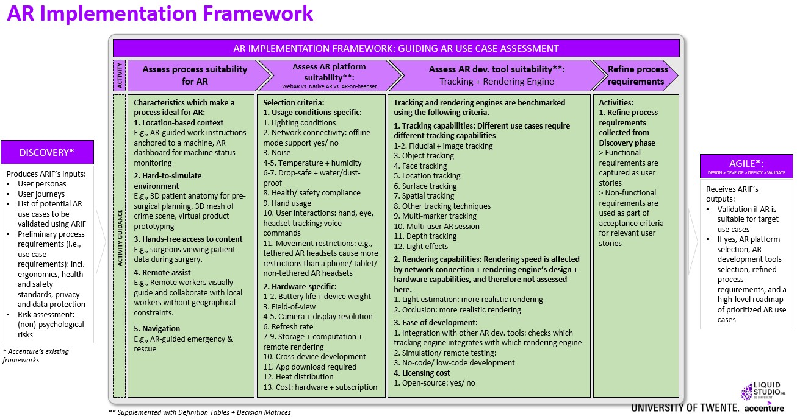
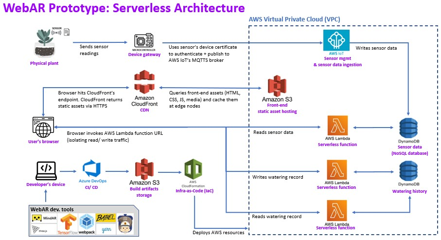

# WebAR Prototype + AR Implementation Framework
## INTRODUCTION
This repository stores the outputs of Kristen Phan's internship (kristen.phan@accenture.com):
1. WebAR prototype: AR running directly in a web browser; deployed on an AWS serverless architecture; helps monitor the health of houseplant through the use of an AR dashboard with real-time data from soil moisture sensor and watering history records.
2. AR Implementation Framework: guides the design and implementation of AR solutions so that ACN can deliver many AR solutions to come, not just a single WebAR prototype that Kristen's built; View ```./AR-implementation-framework-presentation-slides``` for details on the framework.
3. Jira: https://kristenphan.atlassian.net/jira/software/projects/ATP/boards/2

### WebAR Prototype Demo
<br />


<br />

### AR Implementation Framework
<br />


<br />

## HOW TO DEPLOY THE APPLICATION?
1. Register a sensor as a Thing and request a device certificate for the sensor in IoT Core console 
2. Create a ```secrets.h``` which defines ```WIFI_SSID``` and ```WIFI_PASSWORD``` (Wifi credentials for the ESP32 to connect to the Wifi), ```AWS_CERT_CRT``` and ```AWS_CERT_PRIVATE``` (the sensor's device certificate: public and private key), and ```AWS_CERT_CA``` (the AWS Root CA public key)
3. Use [Arduino IDE](https://www.arduino.cc/en/software/) to compile and upload ```secrets.h``` along with ```./backend/esp32/stream-to-iot.ino``` to the ESP32 microcontroller, allowing the microcontroller to connect to a Wifi network and publish sensor data to AWS IoT Core. This is because code for the ESP32 is not part of the CI/CD pipeline and needs to be compiled and uploaded to the ESP32 manually
4. Create an AWS account and IAM user profile
5. Attach a policy with the specified permissions to the user profile - see Appendix A
6. Create [access key Id and secret access key](https://docs.aws.amazon.com/powershell/latest/userguide/pstools-appendix-sign-up.html) for the user profile
7. Create an AWS service connection called "aws-sc" as referenced in ```./azure-pipelines.yml``` using the access key Id and secret access key in Azure DevOps console to allow Azure DevOps to connect to AWS
8. Push the code to Azure DevOps Repository
9. Create a new Pipeline in Azure DevOps Pipelines by referencing ```./azure-pipelines.yml```
10. Run the pipeline manually from Azure DevOps Pipelines console. Or the pipeline is auto triggered with a new commit.
11. The deployed application can be accessed at the deployed CloudFront distribution endpoint and runs on all major browsers (best on iOS Safari/ Chrome). When running the application in a browser, point the device at the image marker. An AR dashboard for monitoring the health of houseplant will be rendered as anchored to the image marker.

## PROTOTYPE SERVERLESS ARCHITECTURE
1. Tracking engine: implements image tracking technique by [MindAR](https://hiukim.github.io/mind-ar-js-doc/). The image marker can be found in ```./frontend/assets/targets/acn.png```. The image marker is compiled using [MindAR's compiler](https://hiukim.github.io/mind-ar-js-doc/quick-start/compile) and can be found in ```./frontend/assets/targets/acn.mind```.
<br />
<br />


<br />

2. Rendering engine: implements [three.js](https://threejs.org/).
3. Hand gesture recognition: implements [Tensorflow's pre-trained fingerpose model](https://github.com/andypotato/fingerpose) for thumbs-up and thumbs-down gestures.
4. Build tools: [webpack](https://webpack.js.org/) for concatenating all .JS files into a single .JS file; [babel](https://babeljs.io/) for transpiling code so that older browsers can understand; [yarn](https://yarnpkg.com/) as package manager; [AWS SAM CLI](https://docs.aws.amazon.com/serverless-application-model/latest/developerguide/serverless-sam-cli-command-reference.html) is used to deploy AWS resources using SAM/ CloudFormation templates.  
5. Moisture sensor and microcontroler: a physical houseplant is fitted with a generic moisture sensor and an [ESP32 microcontroller](https://www.espressif.com/en/products/socs/esp32). The sensor and the microcontroller are configured using [Arduino IDE](https://www.arduino.cc/en/software/) - see code in ```./backend/arduino-esp32/stream-to-iot.ino```. Not tracked by Git is ```./backend/arduino-esp32/secrets.h```.    
6. Frontend: consists of S3 frontend bucket + CloudFront distribution; The tracking, rendering, and Tensorflow all run on the frontend using the browser's access to live camera feed. The live camera feed therefore stays on the user's device and is not transmitted elsewhere. 
7. Backend: consists of Lambda + DDB + IoT
8. S3: 2 buckets - one bucket storing the build artifacts generated by Azure DevOps Pipelines, another bucket storing the frontend's static assets (HTML, CSS, JS, and media). The S3 frontend bucket is not publicly facing and only accepts traffic from the CloudFront distribution via HTTPS.
9. CloudFront: sits in front of S3; queries static contents from S3 frontend bucket and serves them to browser via HTTPS since most browsers require HTTPS in order to access webcam when running the AR application.
10. Lambda: public facing but accept only CloudFront Distribution endpoint as the origin via HTTPS. Write and read traffic are isolated to allow lambda to scale independently. 
11. DynamoDB: consists of 2 tables: one to store sensor data, another to store watering records. For the sensor data table, time-to-live is configured to auto expire sensor data more than 30 days old;
12. IoT: register sensor device and request a device certificate in IoT Core console. Using the device certificate, the microcontroller authenticates and publish sensor data it receives from the sensor to IoT Core every 5 seconds  via MQTTS. IoT Core then writes all sensor data arrived at a specified publish topic to ddb. 
13. CloudFormation: Use SAM CLI and SAM/ CloudFormation templates to deploy the frontend and backend resources on AWS. SAM/ CloudFormation templates are defined in ```./frontend/samconfig.toml```, ```./frontend/template.yaml```, ```./backend/samconfig.toml```, and ```./frontend/template.yaml```.
14. Azure DevOps: store source code in Azure DevOps Repository and execute CI/CD pipeline defined in ```./azure-pipelines.yml``` using Azure DevOps Pipelines service. The build and deployment tasks are executed on Azure's hosted agents. In ```./azure-pipelines.yaml```, SAM CLI commands and others are executed to build and deploy the frontend and backend to AWS. 
<br />
<br />


<br />

## LIMITATIONS
1. IAM permissions in Appendix A should be restricted for S3, IoT, and CloudFront. Full access was given during development because of time constraints. 
2. Lambda functions are publicly accessible but are configured with a CORS policy to accept only traffic from CloudFront's CDN endpoint. As new lambda functions are created with new lambda function URLs, the lambda function URLs need to be updated accordingly in ```./frontend/.env``` so that the frontend can invoke the lambdas at their new function URLs.
3. There is not yet a CloudFormation ```AWS::IoT::Thing``` template for the sensor in the ```./backend/template.yaml```. The sensor is currently registered and provided with a device certificate using the IoT Core console. THINGNAME ```webar-iotthing-soilsensor``` and AWS_IOT_PUBLISH_TOPIC ```webar-iottopic-sensordata``` are hard-coded in ```./backend/arduino-esp32/stream-to-iot.ino```. Note that this AWS_IOT_PUBLISH_TOPIC must match with the topic defined in the ```AWS::IoT::TopicRule``` template in ```./backend/template.yaml``` as this Topic Rule propagates the sensor data published to ```webar-iottopic-sensordata``` to a Dynamodb table.

## APPENDIX A: IAM PERMISSIONS FOR USER PROFILE

```
{
    "Version": "2012-10-17",
    "Statement": [
        {
            "Sid": "VisualEditor0",
            "Effect": "Allow",
            "Action": [
                "lambda:CreateFunction",
                "lambda:TagResource",
                "iam:ListRoleTags",
                "dynamodb:DescribeContributorInsights",
                "iam:CreateRole",
                "iam:AttachRolePolicy",
                "cloudformation:CreateChangeSet",
                "iam:PutRolePolicy",
                "dynamodb:DeleteTable",
                "cloudfront:*",
                "cloudformation:DescribeStackEvents",
                "dynamodb:DescribeTable",
                "cloudformation:UpdateStack",
                "dynamodb:DescribeContinuousBackups",
                "lambda:DeleteFunction",
                "cloudformation:DescribeChangeSet",
                "cloudformation:ExecuteChangeSet",
                "lambda:UpdateFunctionUrlConfig",
                "lambda:CreateFunctionUrlConfig",
                "iam:ListPolicies",
                "iam:GetRole",
                "dynamodb:UpdateTimeToLive",
                "application-autoscaling:RegisterScalableTarget",
                "cloudformation:DescribeStackResources",
                "iam:DeleteRole",
                "application-autoscaling:DeleteScalingPolicy",
                "iam:TagPolicy",
                "cloudformation:DescribeStacks",
                "dynamodb:CreateTable",
                "lambda:UpdateFunctionCode",
                "application-autoscaling:DescribeScalingPolicies",
                "application-autoscaling:PutScalingPolicy",
                "iam:GetRolePolicy",
                "dynamodb:UpdateTable",
                "iam:UntagRole",
                "iot:*",
                "iam:TagRole",
                "dynamodb:ListTagsOfResource",
                "lambda:UntagResource",
                "cloudformation:DeleteChangeSet",
                "iam:PassRole",
                "dynamodb:TagResource",
                "lambda:ListTags",
                "iam:DeleteRolePolicy",
                "dynamodb:DescribeKinesisStreamingDestination",
                "iam:ListPolicyTags",
                "dynamodb:UntagResource",
                "s3:*",
                "application-autoscaling:DescribeScalableTargets",
                "lambda:GetFunction",
                "lambda:UpdateFunctionConfiguration",
                "dynamodb:DescribeTimeToLive",
                "iam:TagUser",
                "cloudformation:GetTemplateSummary",
                "iam:UntagUser",
                "lambda:AddPermission",
                "cloudformation:CreateStack",
                "iam:UntagPolicy",
                "application-autoscaling:DescribeScheduledActions",
                "lambda:DeleteFunctionUrlConfig",
                "lambda:RemovePermission",
                "application-autoscaling:DeregisterScalableTarget",
                "iam:ListUserTags"
            ],
            "Resource": "*"
        }
    ]
}
```
